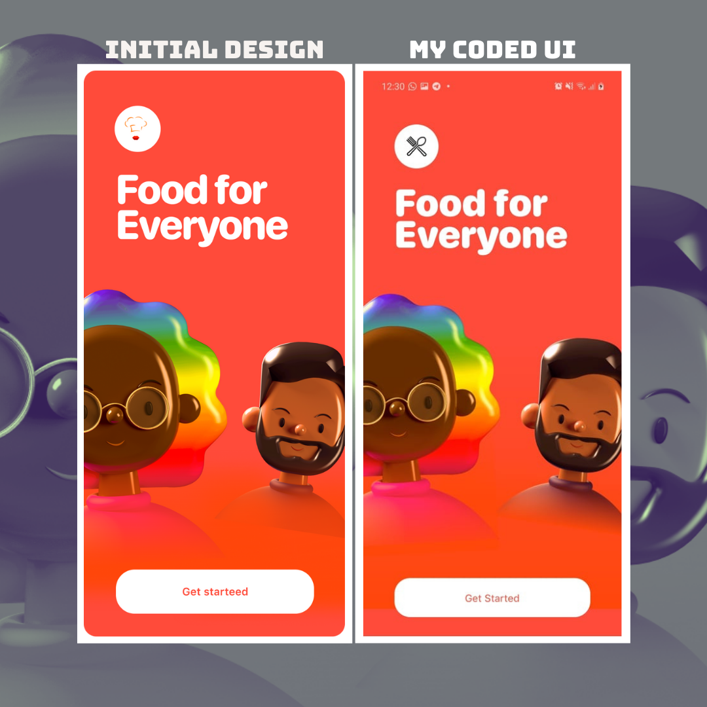

# UI Challenge

I don't know if anyone ever would see this repository but if you did ... well , Hello 🖐.

**let me tell you why I am creating this?**
I've always considered styling and design UI elements is the biggest advantage I have as a front-end developer, actually it's the part that I'm enjoying the most.

I'm trying to keep up with this skill and keep improving my self through these challenges.

**What is UI Challenge?**
I'll try to create Mobile Interfaces using **_React Native_**, each Challenge will be implemented using different tools and techniques.

**Why is this open-sourced?** for a long time I was thinking open-source project should be softwares or tools that help thousand of developers. And I was wrong any code can be open-sourced.
**open-source is a mentality more than anything else**.

**How can this help others?** I literally don't know. I hope it at least inspires someone to start with any project in his/her mind.

## Challenges

#### 1. Food For Everyone.

I decided to start with a very simple challenge just to keep my enthusiasm about this project and remember some of the tools that i've been using months ago.

📃 **Brief:**
a simple walk-though page.

⌛ **Working hours:** 1.5 hours.

📦 **Used Packages:**

```json
    "react-native-linear-gradient": "^2.5.6",
    "styled-components": "^5.2.1",
```

🎉 **Result:**

